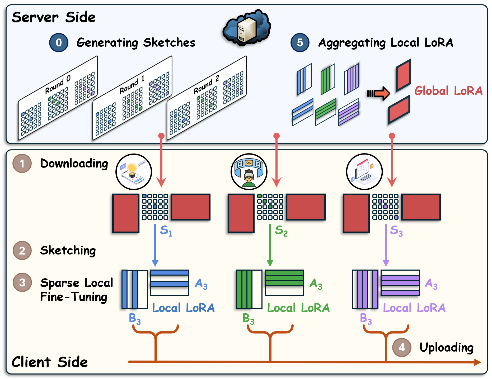

## Federated Sketching LoRA: On-Device Collaborative Fine-Tuning of Large Language Models

[](https://www.python.org/downloads/release/python-31012/)
[](https://opensource.org/licenses/MIT) 

---
ICML Submission 2308

---

## 🔥 Our Framework

TL, DR: In this repo, we provide the implementation of **Federated Sketching LoRA** (FSLoRA), a novel methodology for collaborative LLM fine-tuning across resource-heterogeneous devices

<div align="center">
    
</div>


## 🖥️ Prerequisites

Install the required packages via:
```bash
pip install -r requirements.txt
```

Alternatively, ensure the following dependencies are installed:
```plaintext
python == 3.10.14
torch == 2.5.1
transformers == 4.47.1
peft == 0.14.0
accelerate == 1.2.1
bitsandbytes == 0.45.0
datasets == 3.2.0
```

## 🗂️ Folder Structure
```
FSLoRA/
│   README.md
│   requirements.txt
│
├─── GLUE/
│   │   arg.py
│   │   main_slora_glue_het.py
│   │   models.py
│   │   data_utils.py
│   │   train_utils.py
│   │   run_main.sh
│
├─── Commensen_reasoning/
│   │   arg.py
│   │   LoRA_sketching_llama_het.py
│   │   evaluation_par.py
│   │   models.py
│   │   utils_data.py
│   │   utils_train.py
│   │   main.py
│   │   run_main.sh
```
- **`GLUE/`**: Contains the primary codebase for RoBERTa on the GLUE benchmark.
  - `main_slora_glue_het.py`: Our FSLoRA framework for GLUE.
  - `models.py`: Includes building model.
  - `utils_data.py`: Data preprocessing.
  - `run_main.sh`: Passing args and call `main_slora_glue_het.py`.

- **`Commensen_reasoning/`**: Contains the primary codebase for LLaMA-3.2-3B on the Commensense Reasoning benchmark.
  - `LoRA_sketching_llama_het.py`: Our FSLoRA framework for LLaMA-3.2-3B.
  - `models.py`: Includes building model.
  - `evaluation_par.py`: For evaluation.
  - `run_main.sh`: Execute FSLoRA algorithm and evaluate the checkpoints


## 🏃‍♂ Run Code

Run our framework with the following command:
```bash
python main/run_main.sh
```
This code runs with 4 NVIDIA A100 GPUs in parallel, using the Accelerate library for efficient multi-GPU support.
